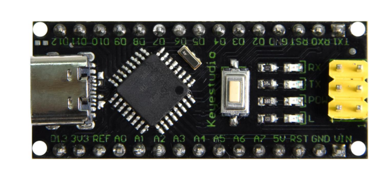
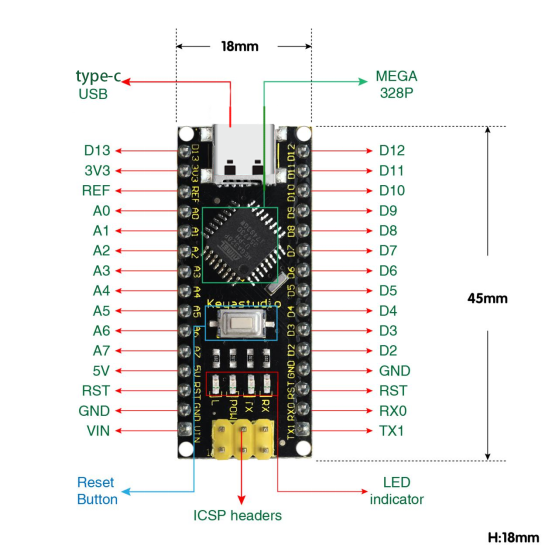
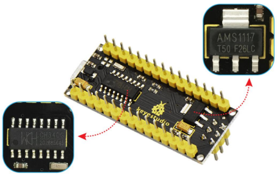
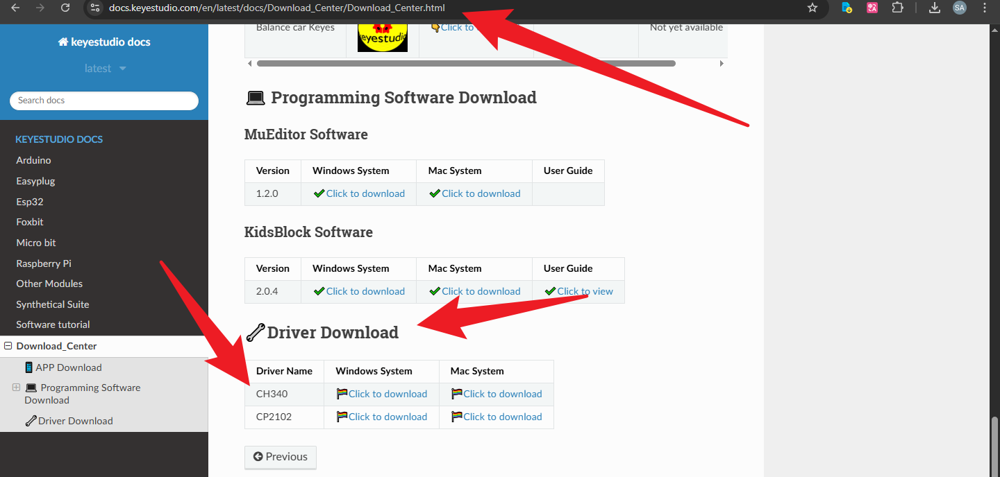
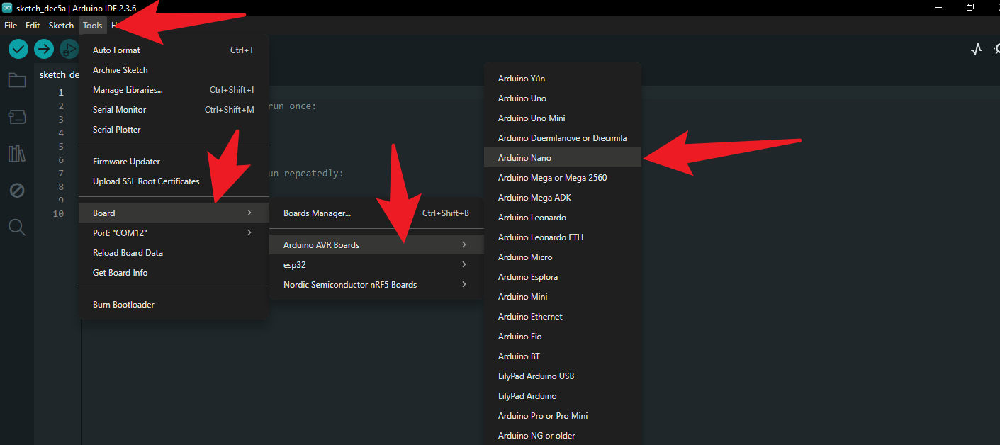
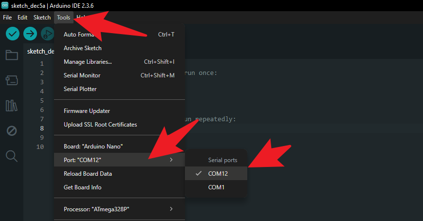
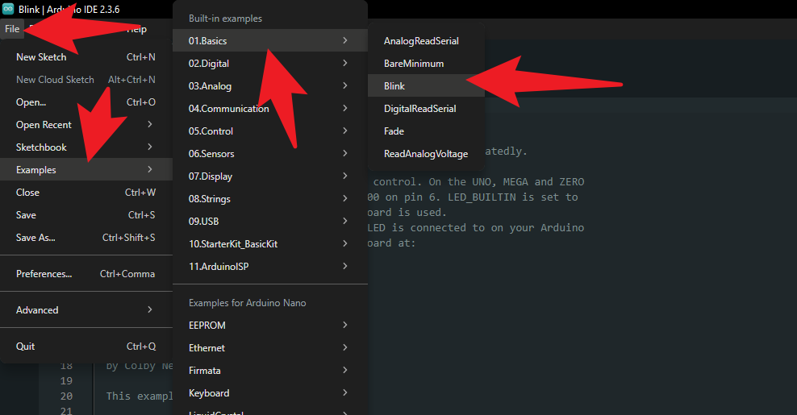

# KS0547 Keyestudio NANO PLUS

## 1. Description

The processor core of Keyestudio NANO PLUS is **the** ATMEGA328P-AU. It is **the same as** the official Arduino Nano, **except for the** driver file and USB-to-serial chip (CH340C).

It features 14 digital input/output interfaces (6 of which can be used as PWM outputs), 8 analog input interfaces, a 16MHz crystal oscillator, an ICSP interface, and a reset button.

The ICSP interface is used to program the Atmega328P-AU. We can supply power via a **Type-C USB** cable or through the VIN/GND ports (DC 7-12V).

## 2.Specification

**Microcontroller:** ATMEGA328P-AU

**Operating Voltage:** 5V 

**Input Voltage (recommended):** DC 7-12V 

**Digital I/O Pins:** 14 (D0-D13) 

**PWM Digital I/O Pins:** 6 (D3, D5, D6, D9, D10, D11) 

**Analog Input Pins:** 8 (A0-A7) 

**DC Current per I/O Pin:** 40 mA (Max) 

**Flash Memory:** 32 KB (of which 2 KB is used by bootloader) 

**SRAM:** 2 KB

**EEPROM:** 1 KB 

**Clock Speed:** 16 MHz 

**LED_BUILTIN:** D13

## 3.Pins

| 1    | ICSP Header              | ***\*ICSP\**** ***\*(In-Circuit Serial Programming) Header\****ICSP is the AVR, an micro-program header consisting of MOSI, MISO, SCK, RESET, VCC, and GND. It is often called the SPI (serial peripheral interface) and can be considered an "extension" of output. In fact, slave the output devices under the SPI bus host.When connecting to PC, program the firmware to ATMEGA328P-AU. |
| ---- | ------------------------ | ------------------------------------------------------------ |
| 2    | LED indicator（RX）      | Onboard you can find the label: RX(receive )When control board communicates via serial port, receive the message, RX led flashes. |
| 3    | LED indicator（TX）      | Onboard you can find the label: TX (transmit)When control board communicates via serial port, send the message, TX led flashes. |
| 4    | LED indicator（POW）     | Power up the control board, LED on, otherwise LED off.       |
| 5    | LED indicator（L）       | There is a built-in LED driven by digital pin 13. When the pin is HIGH value, the LED is on, when the pin is LOW, it's off. |
| 6    | RX0（D0）TX1（D1）D2-D13 | It has 14 digital input/output pins D0-D13 (of which 6 can be used as PWM outputs). These pins can be configured as digital input pin to read the logic value (0 or 1). Or used as digital output pin to drive different modules like LED, relay, etc. |
| 7    | RST                      | Reset pin: connect external button. The function is the same as RESET button. |
| 8    | MEGA 328P                | Each board has its own microcontroller. You can regard it as the brain of your board.Microcontrollers are usually from ATMEL. Before you load a new program on the Arduino IDE, you must know what IC is on your board. This information can be checked at the top surface of IC.The board’s microcontroller is ATMEGA328P-AU. More info. see the [datasheet ](http://101.96.10.64/ww1.microchip.com/downloads/en/DeviceDoc/Atmel-42735-8-bit-AVR-Microcontroller-ATmega328-328P_Summary.pdf) |
| 9    | Type-c USB               | The board can be powered via Type-c USB connection. Also upload the program to the board via USB port. |
| 10   | 3V3 pin                  | Provides 3.3V voltage output                                 |
| 11   | REF                      | Reference external voltage (0-5 volts) for the analog input pins. Used with [analogReference()](https://www.arduino.cc/reference/en/language/functions/analog-io/analogreference/). |
| 12   | A0-A7                    | The Nano has 8 Analog Pins, labeled A0 through A7.           |
| 13   | 5V pin                   | Provides 5V voltage output                                   |
| 14   | GND                      | Ground pin                                                   |
| 15   | VIN                      | Input an external voltage DC7-12V to power the board.        |
| 16   | Reset Button             | Used to reset the control board                              |
| 17   | CH340 C                  | USB-to-serial port chip, converting the USB signal into Serial port signal. |
| 18   | AMS1117                  | Convert the external voltage input DC7-12V into DC5V, then transfer it to the processor and other elements. |

## 3.Specialized Functions of Some Pins:

- **Serial Communication:** 0 (RX) and 1 (TX). Used to receive (RX) and transmit (TX) TTL serial data.
- **PWM (Pulse-Width Modulation):** D3, D5, D6, D9, D10, D11.
- **External Interrupts:** D2 (interrupt 0) and D3 (interrupt 1). These pins can be configured to trigger an interrupt on a low value, a rising or falling edge, or a change in value. See the `attachInterrupt()` function for details.
- **SPI Communication:** D10 (SS), D11 (MOSI), D12 (MISO), D13 (SCK).
- **I2C Communication:** A4 (SDA), A5 (SCL).

The KS0547 Keyestudio NANO PLUS uses the CH340 driver. If your board is not recognized by the computer, please click the link. Refer to the image to download and install the correct driver for your operating system.

Click the link:https://docs.keyestudio.com/en/latest/docs/Download_Center/Download_Center.html

## 4.How to Use

**Configuring the Arduino IDE**

1. **Ensure Installation:** Make sure you have downloaded and installed the latest version of the Arduino IDE.

2. **Open the Arduino IDE.**

3. **Select Board:**

   - Click on **Tools** > **Board** > **Arduino AVR Boards** in the menu bar.

   - Select **Arduino Nano**.

     

4. **Select Processor:**

   - Click on **Tools** > **Processor**.
   - Select **ATmega328P**.
   - *(Note: If the upload fails, please try selecting **ATmega328P (Old Bootloader)**. Although the PLUS version typically uses the new Bootloader, it is always good to have an alternative).*

5. **Select Port:**

   - Click on **Tools** > **Port**.

   - Select the COM port you just saw in Device Manager (e.g., COM12).

     

**3. Upload the First Test Program (Blink)**

Let's test if the board is working properly by lighting up the onboard LED (connected to pin D13).

1. **Load Example Code:**

   - Click **File** > **Examples** > **01.Basics** > **Blink**.

     

2. **Upload Code:**

   - Click the **Right Arrow Icon** (Upload) button in the top-left corner of the IDE.

3. **Observe Results:**

   - The status bar at the bottom of the IDE will show "Compiling sketch" followed by "Uploading".
   - When **"Done uploading"** is displayed, look at your NANO PLUS board.
   - If the red LED (marked "L") on the board starts blinking once every second, congratulations! You have successfully set up the Keyestudio NANO PLUS.